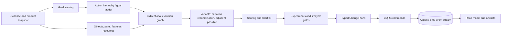

# TwinStudio 0.5.0

TwinStudio is a Docker-first reference implementation of an **event-sourced product digital thread**. It joins product structure, CAD and 2D/3D evidence, requirements, manufacturing routes, simulations, lifecycle gates, controlled natural-language changes and project-evolution methods in one versioned workspace.

The included demonstration project is a Raspberry Pi 5 + Camera Module 3 appliance with a two-part printed enclosure. The enclosure remains an example; the platform is designed to support mixed physical, electronic and software products.

## What 0.5.0 adds

TwinStudio 0.5.0 adds a controlled project-evolution layer intended to reduce design and goal fixation:

- a source-grounded feature-lens catalog with 49 identifiable active lenses and one explicitly unresolved source slot rather than an invented fiftieth item;
- a controlled action/verb lexicon for goal ladders, synonyms, hypernyms, hyponyms, opposites and adjacent actions;
- bidirectional goal-resource graphs, object decomposition, BrainSwarming-style idea lineage, adjacent-possible exploration, mutation, recombination and experiment planning;
- 34 TwinStudio engineering dimensions covering manufacturability, assemblability, serviceability, reliability, security, sustainability, observability, reversibility and other lifecycle concerns;
- 17 declarative evolution operators, including goal reframing, feature repurposing, parameter shifts, material/process substitution, modularization, reversibility and crossover;
- expanded hardware, digital-product and continuous-evolution lifecycle templates;
- **TwinScript 1.0**, YAML and JSON representations of one canonical `EvolutionProgram` model;
- JSON Schema, EBNF grammar, REST, CLI, MCP and browser access to the DSL;
- auditable evolution artifacts: canonical program, run, graph in JSON/DOT/Mermaid, candidate CSV, Markdown report, lifecycle blueprint, execution record and manifest.

The evolution engine proposes hypotheses. It does not treat a graph score as proof that a mechanical, electrical or software design works. Shortlisted candidates still require simulation, prototyping, tests and approval evidence.

## Existing platform capabilities

- Interactive object tree and 3D/2D viewer.
- Pointer, pencil, lasso and rectangle selection evidence.
- Persistent `SelectionMap` resolution to POA object, feature, semantic-face and optional B-Rep identities.
- Natural-language to typed `ChangePlan` compilation through LiteLLM structured output or a deterministic local planner.
- Strict Product Object Addressing scope validation.
- Event-sourced scalar parameter changes and a narrow allow-listed CadQuery STEP/B-Rep adapter for hole and local-box operations.
- xBOM views for FDM, CNC, purchase, PCB, software, packaging and reference-only objects.
- CQRS, append-only events and optimistic concurrency.
- Email-approval onboarding, per-project roles and HTTP Basic `email:personal-token` automation access.
- REST/OpenAPI, CLI, shell, WebSocket, MQTT and MCP tools/resources.
- Reduced-order power, voltage-drop and thermal models, human-use checks, mechanical rules, FMEA and test plans.
- Portable `.twinstudio.zip` project exports with snapshot, event stream, specification, artifacts and SHA-256 manifest.

## Quick start

### Docker

```bash
test -f .env || cp .env.example .env
docker compose up --build
```

Open:

- application: `http://localhost:8000`
- REST/OpenAPI: `http://localhost:8000/docs`
- Mailpit: `http://localhost:8025`

Optional profiles:

```bash
docker compose --profile cad up --build
docker compose --profile integration up --build
docker compose --profile simulation up --build
docker compose --profile openwebui up --build
docker compose --profile object-store up --build
```

### Local Python

```bash
python3.12 -m venv --clear .venv
.venv/bin/python --version
.venv/bin/python -m pip install --upgrade pip
.venv/bin/python -m pip install -e ".[llm,dev]" -e "./components/housing-studio[dev]"
test -f .env.local || cp .env.local.example .env.local
.venv/bin/twinstudio seed
make start
```

`--clear` makes an existing `.venv` use the requested interpreter instead of retaining stale
symlinks from Conda or another Python installation. `.env.local` overrides the Docker-oriented
`.env` only for the Python process, so both launch methods can coexist in one checkout. Use
`.venv/bin/...` directly to make the selected interpreter explicit.

The Makefile owns the local server PID and log in the ignored `.run/` directory. `make start`
always replaces an existing TwinStudio instance from this workspace, so a stale process cannot
leave port 8500 occupied. It refuses to kill an unrelated application using the same port.

```bash
make start        # replace and start in the background
make restart      # same controlled recreation, stated explicitly
make status       # PID, URL and /health
make health       # raw /health response
make logs         # latest log lines (use LINES=250 make logs)
make logs-follow  # follow the log
make stop         # graceful stop, then SIGKILL only if the owned process hangs
make run          # replace and serve in the foreground
```

LiteLLM is optional. When `LITELLM_MODEL` is empty, controlled local planners and evolution catalogs are used.

## TwinScript example

```text
TWINSCRIPT 1.0
NAME "RPi5 hinge evolution"
PROJECT demo-rpi5 REVISION main
FOCUS "poa://demo/demo-rpi5@main/part/base"
FOCUS "poa://demo/demo-rpi5@main/part/lid"

GOAL VERB improve OBJECT "front hinge" \
  OUTCOME "support-free printing, a clean joint and opening above 190 degrees"
PRESERVE "wall thickness remains 2 mm"
AVOID "hinge collision"
ASSUME "the current hinge is only one possible mechanism"

METHODS goal_ladder,object_decomposition,bidirectional_graph,feature_lenses,adjacent_possible,brainswarm,mutation,recombination,experiment
LENSES shape,connectivity_among_parts,force_characteristics,human_use,aesthetics
DIMENSIONS manufacturability,assemblability,serviceability,testability,reversibility,adjacent_possible
EVOLVE POPULATION 12 GENERATIONS 3 OFFSPRING 2 MUTATION 0.8 CROSSOVER 0.3 SEED 17
SELECT_TOP 5
LIFECYCLE hardware-product START detailed_design TARGET verification APPROVAL true
VERIFY "print and cycle a hinge prototype"
REALIZE change_plan DRY_RUN true APPROVAL true MAX_PLANS 3
OUTPUT GRAPHS json,dot,mermaid REPORTS json,markdown,csv
END
```

The complete example is in `examples/evolution/rpi5-hinge-evolution.twin`, with equivalent YAML and JSON files.

### CLI

```bash
twinstudio dsl-parse examples/evolution/rpi5-hinge-evolution.twin
twinstudio dsl-preview examples/evolution/rpi5-hinge-evolution.twin --project-id demo-rpi5
# Records the evolution run, lifecycle blueprint, plans and report artifacts:
twinstudio dsl-apply examples/evolution/rpi5-hinge-evolution.twin --project-id demo-rpi5 --execute
```

### KiCad EDA shell and firmware audit

The EDA commands use the same SubLLM policy as Viewer. `plan` produces a
typed, approval-required change document; `check` validates it, and `apply`
creates a candidate rather than changing the original KiCad file.

Lossless KiCad S-expression parsing, typed PCB inspection and deterministic
copper-routing primitives, including bounded multi-net rip-up-and-retry and a
fail-closed two-layer maze router, come from the independently versioned
[`digitaltwin-run/twin-kicad`](https://github.com/digitaltwin-run/twin-kicad)
package. TwinStudio retains operation planning, candidates, authority and
history; it does not keep its own parser or router implementations. Routing
primitives preserve each declared width, rectilinear geometry and explicit via
dimensions. Overlapping foreign nets remain blocked instead of being erased by
raster order. An incomplete result remains diagnostic evidence and cannot be
presented as a production route or promoted without the normal connectivity,
DRC and human-decision gates.

```bash
# Interactive SCH/PCB editor: write a prompt, then use :check and :apply.
twinstudio eda shell pcb/panel9.kicad_sch

# Non-interactive plan with the active SubLLM route (Z.AI GLM 5.3 first).
twinstudio eda plan pcb/panel9.kicad_sch \
  'Zmień wartość rezystora R1 na 68k. Nie zmieniaj innych elementów.' \
  --out /tmp/r1-68k.json
twinstudio eda check /tmp/r1-68k.json
twinstudio eda apply /tmp/r1-68k.json

# Deterministic GPIO facts + GLM-5.3 review. The schematic path is relative
# to --kicad-root; firmware paths are explicit local files.
twinstudio eda audit-firmware pcb/panel9.kicad_sch \
  --firmware /home/tom/github/maskservice/rp2040-keyboard/rp2040_keyboard/firmware/code.py \
  --firmware /home/tom/github/maskservice/rp2040-keyboard/rp2040_keyboard/firmware/generator.py
```

The firmware audit compares only explicit `GP/GPIO` labels. It reports missing
or extra labels but cannot prove unlabeled wire continuity; run ERC or compare
a KiCad netlist before treating it as an electrical sign-off.

`POST /api/v1/eda/schematic-state` accepts the normalized Eeschema netlist and
uses it to detect single-node nets, floating or unpowered pins, isolated parts,
split rails and SCH–PCB drift. Without a netlist it returns the explicit
`EDA-SCH-NETGRAPH-001` limitation instead of inferring connectivity from drawing
geometry.

### REST

```text
GET  /api/v1/evolution/catalog
GET  /api/v1/dsl/schema
GET  /api/v1/dsl/grammar
POST /api/v1/dsl/parse
POST /api/v1/projects/{project_id}/dsl/preview
POST /api/v1/projects/{project_id}/dsl/apply
GET  /api/v1/projects/{project_id}/evolution/runs
GET  /api/v1/projects/{project_id}/evolution/runs/{run_id}/graph
POST /api/v1/projects/{project_id}/evolution/runs/{run_id}/candidates/{candidate_id}/change-plan
GET  /api/v1/projects/{project_id}/lifecycles
POST /api/v1/projects/{project_id}/lifecycles/transition
```

The browser includes an **Evolution DSL** tab with an editor, schema and grammar links, preview, shortlisted candidates and a deliberate confirmation step before CQRS persistence.

## Schemas and contracts

- `schemas/twin-dsl.schema.json` — canonical DSL document.
- `schemas/twinscript.ebnf` — text syntax.
- `schemas/evolution-run.schema.json` — generated run and candidate lineage.
- `schemas/lifecycle-blueprint.schema.json` — tailored lifecycle graph.
- `schemas/evolution-catalog.schema.json` — controlled catalog.
- `schemas/twinstudio-project.schema.json` — portable Digital Twin project and artifact heads.
- `schemas/eda-history-entry.schema.json` — event envelope for portable EDA history.
- `schemas/index.json` — schema-set index.
- `proto/lps/v1/` — retained wire-contract namespace for compatibility; new product branding is TwinStudio.

Regenerate JSON Schemas:

```bash
PYTHONPATH=src python scripts/generate_schemas.py
```

## Architecture



## Important boundaries

1. Arbitrary free-form B-Rep editing and native SolidWorks feature-history reconstruction are not implemented.
2. Photograph-to-3D automation requires a calibrated projection/entity map; otherwise the system records scoped evidence rather than guessing geometry.
3. PCB/SCH support is a product model and adapter boundary, not a production autorouter or circuit synthesizer.
4. Power and thermal calculations are reduced-order models and require measurement and physical validation.
5. Human-use checks are structured task and rule evaluations, not a biomechanical digital-human simulation.
6. Evolution scores are prioritization aids, not verification evidence.
7. LiteLLM is restricted to typed plans and structured alternatives; generated Python or shell code is not executed.
8. Development authentication defaults are not a production security configuration.
9. The synchronous MCP core does not yet provide request-scoped SSE, subscriptions, MRTR or a production OAuth server.

See `docs/IMPLEMENTATION_STATUS.md`, `docs/18_PROJECT_EVOLUTION_DSL_PL.md`, `docs/19_TWINSCRIPT_API_REFERENCE.md` and `docs/VERIFICATION.md`.
