# System Architecture Analysis
<!-- generated in 0.01s -->

## Overview

- **Project**: /home/tom/github/digitaltwin-run/twinstudio
- **Primary Language**: python
- **Languages**: python: 58, json: 32, yaml: 15, proto: 8, txt: 7
- **Analysis Mode**: static
- **Total Functions**: 634
- **Total Classes**: 151
- **Modules**: 137
- **Entry Points**: 314

## Architecture by Module

### app.static.app
- **Functions**: 140
- **File**: `app.js`

### services.cad-worker.vendor.rpi5_housing_studio.app.static.app
- **Functions**: 89
- **File**: `app.js`

### src.living_product_studio.static.app
- **Functions**: 49
- **File**: `app.js`

### src.living_product_studio.api
- **Functions**: 37
- **Classes**: 7
- **File**: `api.py`

### housing_studio.draw2d
- **Functions**: 30
- **Classes**: 7
- **File**: `draw2d.py`

### services.cad-worker.vendor.rpi5_housing_studio.housing_studio.draw2d
- **Functions**: 30
- **Classes**: 7
- **File**: `draw2d.py`

### src.living_product_studio.event_store
- **Functions**: 17
- **Classes**: 2
- **File**: `event_store.py`

### housing_studio.cad3d
- **Functions**: 15
- **Classes**: 1
- **File**: `cad3d.py`

### services.cad-worker.vendor.rpi5_housing_studio.housing_studio.cad3d
- **Functions**: 15
- **Classes**: 1
- **File**: `cad3d.py`

### app.main
- **Functions**: 15
- **Classes**: 4
- **File**: `main.py`

### src.living_product_studio.cli
- **Functions**: 12
- **File**: `cli.py`

### src.living_product_studio.change_planner
- **Functions**: 12
- **Classes**: 3
- **File**: `change_planner.py`

### services.cad-worker.scoped_brep_adapter
- **Functions**: 11
- **Classes**: 1
- **File**: `scoped_brep_adapter.py`

### housing_studio.artifacts
- **Functions**: 11
- **Classes**: 1
- **File**: `artifacts.py`

### src.living_product_studio.mcp_gateway
- **Functions**: 11
- **Classes**: 2
- **File**: `mcp_gateway.py`

### src.living_product_studio.bus
- **Functions**: 10
- **Classes**: 3
- **File**: `bus.py`

### src.living_product_studio.auth
- **Functions**: 10
- **Classes**: 3
- **File**: `auth.py`

### src.living_product_studio.mcp_protocol
- **Functions**: 10
- **Classes**: 1
- **File**: `mcp_protocol.py`

### services.cad-worker.vendor.rpi5_housing_studio.app.main
- **Functions**: 10
- **Classes**: 3
- **File**: `main.py`

### src.living_product_studio.uri
- **Functions**: 8
- **Classes**: 2
- **File**: `uri.py`

## Key Entry Points

Main execution flows into the system:

### housing_studio.artifacts.generate_artifacts
- **Calls**: generated_root.resolve, generated_root.mkdir, job_dir.exists, job_dir.mkdir, services.cad-worker.vendor.rpi5_housing_studio.housing_studio.validation.collect_warnings, housing_studio.artifacts._write_json, records.append, housing_studio.artifacts._write_json

### src.living_product_studio.mcp_gateway.McpGateway.call_tool
- **Calls**: str, self.queries.project, snapshot.memberships.get, McpProtocolError, isinstance, McpProtocolError, self.queries.projects, src.living_product_studio.mcp_gateway._content

### housing_studio.validation.collect_warnings
- **Calls**: housing_studio.validation.board_actual_clearances, math.degrees, math.degrees, math.degrees, warnings.append, warnings.append, any, warnings.append

### src.living_product_studio.bus.CommandBus._handle_existing
- **Calls**: src.living_product_studio.permissions.require_permission, self._event, ObjectNode.model_validate, ArtifactRecord.model_validate, Annotation.model_validate, ChangePlan.model_validate, Requirement.model_validate, EvidenceClaim.model_validate

### generator.main
- **Calls**: argparse.ArgumentParser, parser.add_argument, parser.add_argument, parser.add_argument, parser.add_argument, parser.add_argument, parser.add_argument, parser.add_argument

### src.living_product_studio.change_planner.ChangePlanner._local_plan
- **Calls**: prompt.lower, project.objects.get, src.living_product_studio.change_planner._number_near, src.living_product_studio.change_planner._diameter, any, src.living_product_studio.change_planner._angle, any, any

### housing_studio.mesh_preview.export_preview_scenes
- **Calls**: housing_studio.mesh_preview._load_mesh, housing_studio.mesh_preview._load_mesh, housing_studio.mesh_preview._set_rgba, housing_studio.mesh_preview._set_rgba, trimesh.Scene, closed.add_geometry, closed.add_geometry, closed_glb.parent.mkdir

### app.static.app.initViewer
- **Calls**: app.static.app.loadViewerDependencies, app.static.app.Scene, app.static.app.PerspectiveCamera, app.static.app.set, app.static.app.WebGLRenderer, app.static.app.setPixelRatio, app.static.app.min, app.static.app.appendChild

### services.cad-worker.vendor.rpi5_housing_studio.generator.main
- **Calls**: argparse.ArgumentParser, parser.add_argument, parser.add_argument, parser.add_argument, parser.add_argument, parser.add_argument, parser.add_argument, parser.add_argument

### src.living_product_studio.api.mcp_endpoint
- **Calls**: app.post, request.headers.get, src.living_product_studio.mcp_protocol.classify_mcp_era, auth.principal_from_request, mcp_gateway.handle, None.get, JSONResponse, JSONResponse

### services.cad-worker.vendor.rpi5_housing_studio.app.static.app.initViewer
- **Calls**: services.cad-worker.vendor.rpi5_housing_studio.app.static.app.Scene, services.cad-worker.vendor.rpi5_housing_studio.app.static.app.PerspectiveCamera, services.cad-worker.vendor.rpi5_housing_studio.app.static.app.set, services.cad-worker.vendor.rpi5_housing_studio.app.static.app.copy, services.cad-worker.vendor.rpi5_housing_studio.app.static.app.WebGLRenderer, services.cad-worker.vendor.rpi5_housing_studio.app.static.app.setPixelRatio, services.cad-worker.vendor.rpi5_housing_studio.app.static.app.min, services.cad-worker.vendor.rpi5_housing_studio.app.static.app.appendChild

### services.mqtt-gateway.gateway.on_message
- **Calls**: message.topic.split, str, client.publish, uuid4, json.loads, str, services.mqtt-gateway.gateway.response_topic, json.dumps

### examples.rpi5-camera3.pcb.kicad_adapter.export_review_artifacts
> Export/check a supplied KiCad source through explicit, reviewable CLI calls.

The exact available subcommands depend on the installed KiCad version. R
- **Calls**: output.mkdir, source.suffix.lower, None.write_text, results.append, results.append, json.dumps, examples.rpi5-camera3.pcb.kicad_adapter.run, examples.rpi5-camera3.pcb.kicad_adapter.run

### src.living_product_studio.mcp_gateway.McpGateway.handle
- **Calls**: request.get, request.get, request.get, src.living_product_studio.mcp_protocol.server_discover_result, self._modernize_result, self._error, self._error, self._error

### housing_studio.llm_config.interpret_with_litellm
> Convert a Polish or English natural-language change request into a full config.

The model never emits executable CAD code. It emits JSON constrained 
- **Calls**: None.strip, None.strip, None.strip, housing_studio.llm_config.fallback_interpret, float, completion, housing_studio.llm_config._response_content, ProjectConfig.model_validate_json

### src.living_product_studio.mcp_gateway.McpGateway.tools
- **Calls**: sorted, src.living_product_studio.mcp_gateway._tool, src.living_product_studio.mcp_gateway._tool, src.living_product_studio.mcp_gateway._tool, src.living_product_studio.mcp_gateway._tool, src.living_product_studio.mcp_gateway._tool, src.living_product_studio.mcp_gateway._tool, src.living_product_studio.mcp_gateway._tool

### services.cad-worker.worker.on_message
- **Calls**: message.topic.split, json.loads, client.publish, len, message.payload.decode, payload.get, payload.get, payload.get

### src.living_product_studio.auth.AuthService.request_access
- **Calls**: self.queries.project, None.lower, self.store.create_invitation, self.store.current_version, EventEnvelope, self.store.append, self.publisher.publish_events, self.mailer.send

### src.living_product_studio.event_store.EventStore.approve_invitation
- **Calls**: datetime.now, secrets.token_urlsafe, self.engine.begin, None.first, conn.execute, dict, ValueError, ValueError

### src.living_product_studio.event_store.EventStore.accept_invitation
- **Calls**: datetime.now, self.engine.begin, None.first, conn.execute, dict, ValueError, ValueError, src.living_product_studio.event_store._aware

### src.living_product_studio.auth.AuthService.principal_from_request
- **Calls**: request.cookies.get, request.headers.get, None.startswith, HTTPException, AuthPrincipal, self.store.authenticate_session, self.store.authenticate_api_token, AuthPrincipal

### src.living_product_studio.event_store.EventStore.append
- **Calls**: list, self.engine.begin, None.scalar_one_or_none, int, enumerate, ConcurrencyError, ConcurrencyError, event.model_copy

### app.static.app.generate
- **Calls**: app.static.app.hideBanner, app.static.app.remove, app.static.app.validateConfig, app.static.app.Boolean, app.static.app.fetchJson, app.static.app.stringify, app.static.app.renderWarnings, app.static.app.renderMetrics

### services.cad-worker.vendor.rpi5_housing_studio.housing_studio.draw2d.export_all_2d
- **Calls**: services.cad-worker.vendor.rpi5_housing_studio.housing_studio.draw2d.build_drawing_sets, drawings.items, any, ValueError, DrawingSet, part_dir.mkdir, enabled_views.values, services.cad-worker.vendor.rpi5_housing_studio.housing_studio.draw2d.export_dxf

### scripts.verify_project.main
- **Calls**: argparse.ArgumentParser, parser.add_argument, parser.add_argument, parser.add_argument, parser.parse_args, scripts.verify_project.verify, json.dumps, print

### src.living_product_studio.cli.plan
- **Calls**: app.command, typer.Option, src.living_product_studio.cli.services, queries.project, RegionSelection.model_validate_json, planner.plan, typer.echo, selection.read_text

### src.living_product_studio.cli.shell
> Start a small interactive shell around the same CLI commands.
- **Calls**: app.command, typer.echo, line.split, None.strip, typer.echo, src.living_product_studio.cli.projects_cmd, typer.echo, input

### src.living_product_studio.event_store.EventStore.authenticate_api_token
- **Calls**: datetime.now, self.engine.connect, None.first, None.mappings, src.living_product_studio.event_store._aware, conn.execute, None.where, api_tokens_table.c.revoked_at.is_

### src.living_product_studio.event_store.EventStore.reject_invitation
- **Calls**: self.engine.begin, None.first, conn.execute, dict, ValueError, None.values, None.mappings, None.where

### src.living_product_studio.api.create_annotation
- **Calls**: app.post, Depends, src.living_product_studio.api.authorize_project, queries.project, body.selection.model_copy, Annotation, commands.execute, annotation.model_dump

## Process Flows

Key execution flows identified:

### Flow 1: generate_artifacts
```
generate_artifacts [housing_studio.artifacts]
  └─ →> collect_warnings
      └─> board_actual_clearances
          └─> board_origin
```

### Flow 2: call_tool
```
call_tool [src.living_product_studio.mcp_gateway.McpGateway]
```

### Flow 3: collect_warnings
```
collect_warnings [housing_studio.validation]
  └─> board_actual_clearances
      └─> board_origin
```

### Flow 4: _handle_existing
```
_handle_existing [src.living_product_studio.bus.CommandBus]
  └─ →> require_permission
      └─> has_permission
```

### Flow 5: main
```
main [generator]
```

### Flow 6: _local_plan
```
_local_plan [src.living_product_studio.change_planner.ChangePlanner]
  └─ →> _number_near
      └─> _first_number
  └─ →> _diameter
```

### Flow 7: export_preview_scenes
```
export_preview_scenes [housing_studio.mesh_preview]
  └─> _load_mesh
  └─> _load_mesh
```

### Flow 8: initViewer
```
initViewer [app.static.app]
  └─> loadViewerDependencies
```

### Flow 9: mcp_endpoint
```
mcp_endpoint [src.living_product_studio.api]
  └─ →> classify_mcp_era
      └─> body_protocol_version
          └─> request_meta
```

### Flow 10: on_message
```
on_message [services.mqtt-gateway.gateway]
```

## Key Classes

### src.living_product_studio.event_store.EventStore
- **Methods**: 15
- **Key Methods**: src.living_product_studio.event_store.EventStore.__init__, src.living_product_studio.event_store.EventStore.current_version, src.living_product_studio.event_store.EventStore.append, src.living_product_studio.event_store.EventStore.load, src.living_product_studio.event_store.EventStore.list_streams, src.living_product_studio.event_store.EventStore.delete_stream, src.living_product_studio.event_store.EventStore.ensure_user, src.living_product_studio.event_store.EventStore.create_api_token, src.living_product_studio.event_store.EventStore.authenticate_api_token, src.living_product_studio.event_store.EventStore.create_session

### src.living_product_studio.mcp_gateway.McpGateway
> Small, auditable MCP surface over the same domain services as REST/CLI.

The gateway supports the cu
- **Methods**: 8
- **Key Methods**: src.living_product_studio.mcp_gateway.McpGateway.__init__, src.living_product_studio.mcp_gateway.McpGateway.handle, src.living_product_studio.mcp_gateway.McpGateway._modernize_result, src.living_product_studio.mcp_gateway.McpGateway.tools, src.living_product_studio.mcp_gateway.McpGateway.call_tool, src.living_product_studio.mcp_gateway.McpGateway.resources, src.living_product_studio.mcp_gateway.McpGateway.read_resource, src.living_product_studio.mcp_gateway.McpGateway._error

### src.living_product_studio.auth.AuthService
- **Methods**: 7
- **Key Methods**: src.living_product_studio.auth.AuthService.__init__, src.living_product_studio.auth.AuthService.principal_from_request, src.living_product_studio.auth.AuthService.role_for, src.living_product_studio.auth.AuthService.request_access, src.living_product_studio.auth.AuthService.approve, src.living_product_studio.auth.AuthService.reject, src.living_product_studio.auth.AuthService.accept

### src.living_product_studio.change_planner.ChangePlanner
> Compile a natural-language request into a scoped declarative change plan.

The planner never execute
- **Methods**: 7
- **Key Methods**: src.living_product_studio.change_planner.ChangePlanner.__init__, src.living_product_studio.change_planner.ChangePlanner.plan, src.living_product_studio.change_planner.ChangePlanner._selected_context, src.living_product_studio.change_planner.ChangePlanner._litellm_plan, src.living_product_studio.change_planner.ChangePlanner._local_plan, src.living_product_studio.change_planner.ChangePlanner.validate_scope, src.living_product_studio.change_planner.ChangePlanner.compile_apply_payload

### src.living_product_studio.uri.PoaUri
> Product Object Addressing URI.

Canonical form:
  poa://{tenant}/{project}@{revision}/{kind}/{id}/..
- **Methods**: 6
- **Key Methods**: src.living_product_studio.uri.PoaUri.__post_init__, src.living_product_studio.uri.PoaUri.canonical, src.living_product_studio.uri.PoaUri.child, src.living_product_studio.uri.PoaUri.with_revision, src.living_product_studio.uri.PoaUri.is_ancestor_of, src.living_product_studio.uri.PoaUri.__str__

### services.cad-worker.vendor.rpi5_housing_studio.housing_studio.models.EnclosureDimensions
- **Methods**: 6
- **Key Methods**: services.cad-worker.vendor.rpi5_housing_studio.housing_studio.models.EnclosureDimensions.lid_height, services.cad-worker.vendor.rpi5_housing_studio.housing_studio.models.EnclosureDimensions.top_width, services.cad-worker.vendor.rpi5_housing_studio.housing_studio.models.EnclosureDimensions.top_depth, services.cad-worker.vendor.rpi5_housing_studio.housing_studio.models.EnclosureDimensions.internal_width, services.cad-worker.vendor.rpi5_housing_studio.housing_studio.models.EnclosureDimensions.internal_depth, services.cad-worker.vendor.rpi5_housing_studio.housing_studio.models.EnclosureDimensions.validate_geometry
- **Inherits**: StrictModel

### housing_studio.models.EnclosureDimensions
- **Methods**: 6
- **Key Methods**: housing_studio.models.EnclosureDimensions.lid_height, housing_studio.models.EnclosureDimensions.top_width, housing_studio.models.EnclosureDimensions.top_depth, housing_studio.models.EnclosureDimensions.internal_width, housing_studio.models.EnclosureDimensions.internal_depth, housing_studio.models.EnclosureDimensions.validate_geometry
- **Inherits**: StrictModel

### src.living_product_studio.bus.QueryService
- **Methods**: 5
- **Key Methods**: src.living_product_studio.bus.QueryService.__init__, src.living_product_studio.bus.QueryService.project, src.living_product_studio.bus.QueryService.tree, src.living_product_studio.bus.QueryService.events, src.living_product_studio.bus.QueryService.projects

### src.living_product_studio.bus.CommandBus
- **Methods**: 5
- **Key Methods**: src.living_product_studio.bus.CommandBus.__init__, src.living_product_studio.bus.CommandBus.execute, src.living_product_studio.bus.CommandBus._create_project, src.living_product_studio.bus.CommandBus._handle_existing, src.living_product_studio.bus.CommandBus._event

### src.living_product_studio.api.WsHub
- **Methods**: 4
- **Key Methods**: src.living_product_studio.api.WsHub.__init__, src.living_product_studio.api.WsHub.connect, src.living_product_studio.api.WsHub.disconnect, src.living_product_studio.api.WsHub.broadcast

### src.living_product_studio.mqtt_bus.MqttPublisher
- **Methods**: 3
- **Key Methods**: src.living_product_studio.mqtt_bus.MqttPublisher.__init__, src.living_product_studio.mqtt_bus.MqttPublisher._ensure_client, src.living_product_studio.mqtt_bus.MqttPublisher.publish_events
- **Inherits**: EventPublisher

### src.living_product_studio.auth.Mailer
- **Methods**: 3
- **Key Methods**: src.living_product_studio.auth.Mailer.__init__, src.living_product_studio.auth.Mailer.send, src.living_product_studio.auth.Mailer._write_outbox

### services.cad-worker.vendor.rpi5_housing_studio.housing_studio.models.HingeConfig
- **Methods**: 2
- **Key Methods**: services.cad-worker.vendor.rpi5_housing_studio.housing_studio.models.HingeConfig.bore_diameter, services.cad-worker.vendor.rpi5_housing_studio.housing_studio.models.HingeConfig.validate_hinge
- **Inherits**: StrictModel

### housing_studio.models.HingeConfig
- **Methods**: 2
- **Key Methods**: housing_studio.models.HingeConfig.bore_diameter, housing_studio.models.HingeConfig.validate_hinge
- **Inherits**: StrictModel

### src.living_product_studio.mqtt_bus.EventPublisher
- **Methods**: 1
- **Key Methods**: src.living_product_studio.mqtt_bus.EventPublisher.publish_events

### src.living_product_studio.mqtt_bus.NullPublisher
- **Methods**: 1
- **Key Methods**: src.living_product_studio.mqtt_bus.NullPublisher.publish_events
- **Inherits**: EventPublisher

### services.cad-worker.vendor.rpi5_housing_studio.housing_studio.validation.DesignWarning
- **Methods**: 1
- **Key Methods**: services.cad-worker.vendor.rpi5_housing_studio.housing_studio.validation.DesignWarning.to_dict

### src.living_product_studio.simulations.PowerCaseResult
- **Methods**: 1
- **Key Methods**: src.living_product_studio.simulations.PowerCaseResult.to_dict

### housing_studio.validation.DesignWarning
- **Methods**: 1
- **Key Methods**: housing_studio.validation.DesignWarning.to_dict

### src.living_product_studio.settings.Settings
- **Methods**: 1
- **Key Methods**: src.living_product_studio.settings.Settings.ensure_directories

## Data Transformation Functions

Key functions that process and transform data:

### services.cad-worker.vendor.rpi5_housing_studio.app.static.app.parseEditorConfig
- **Output to**: services.cad-worker.vendor.rpi5_housing_studio.app.static.app.parse

### services.cad-worker.vendor.rpi5_housing_studio.app.static.app.parsed
- **Output to**: services.cad-worker.vendor.rpi5_housing_studio.app.static.app.loadDefaultConfig, services.cad-worker.vendor.rpi5_housing_studio.app.static.app.showBanner

### src.living_product_studio.cli.gtin_validate
- **Output to**: app.command, typer.Exit, src.living_product_studio.gtin.validate_gtin

### src.living_product_studio.gtin.validate_gtin
- **Output to**: bool, value.isdigit, len, src.living_product_studio.gtin.calculate_check_digit

### app.static.app.formatValue
- **Output to**: app.static.app.stringify

### app.static.app.parseEditorConfig
- **Output to**: app.static.app.parse

### app.static.app.parsed
- **Output to**: app.static.app.setConfig

### app.static.app.validateConfig
- **Output to**: app.static.app.hideBanner, app.static.app.parseEditorConfig, app.static.app.fetchJson, app.static.app.stringify, app.static.app.setConfig

### src.living_product_studio.uri.parse_poa_uri
- **Output to**: urlparse, None.rsplit, PoaUri, parsed.scheme.lower, PoaUriError

### src.living_product_studio.change_planner.ChangePlanner.validate_scope
- **Output to**: ScopeViolation, src.living_product_studio.uri.is_within_scope, ScopeViolation

### services.cad-worker.vendor.rpi5_housing_studio.housing_studio.llm_config._json_schema_response_format
- **Output to**: ProjectConfig.model_json_schema

### housing_studio.llm_config._json_schema_response_format
- **Output to**: ProjectConfig.model_json_schema

### src.living_product_studio.mcp_protocol.decode_mcp_header_value
> Decode MCP's ``=?base64?...?=`` header sentinel when present.
- **Output to**: value.startswith, value.endswith, None.decode, len, McpHttpError

### src.living_product_studio.mcp_protocol.validate_modern_http_request
> Validate the core 2026-07-28 Streamable HTTP request contract.

This validates the parts used by thi
- **Output to**: payload.get, str, payload.get, params.get, meta.get

### services.cad-worker.vendor.rpi5_housing_studio.housing_studio.models.EnclosureDimensions.validate_geometry
- **Output to**: model_validator, ValueError, ValueError, ValueError, ValueError

### services.cad-worker.vendor.rpi5_housing_studio.housing_studio.models.HingeConfig.validate_hinge
- **Output to**: model_validator, ValueError

### services.cad-worker.vendor.rpi5_housing_studio.housing_studio.models.StandoffConfig.validate_standoff
- **Output to**: model_validator, ValueError

### services.cad-worker.vendor.rpi5_housing_studio.housing_studio.models.ProjectConfig.validate_project
- **Output to**: model_validator, ValueError, ValueError, ValueError, ValueError

### app.main._validated_config
- **Output to**: ProjectConfig.model_validate, services.cad-worker.vendor.rpi5_housing_studio.housing_studio.models.default_project_config, HTTPException, json.loads, exc.json

### app.main.validate_config
- **Output to**: app.post, app.main._validated_config, config.model_dump, services.cad-worker.vendor.rpi5_housing_studio.housing_studio.validation.design_metrics, app.main._layer_summary

### services.cad-worker.vendor.rpi5_housing_studio.app.main._validated_config
- **Output to**: ProjectConfig.model_validate, services.cad-worker.vendor.rpi5_housing_studio.housing_studio.models.default_project_config, HTTPException, json.loads, exc.json

### src.living_product_studio.domain.RegionSelection.validate_evidence
- **Output to**: model_validator, ValueError, ValueError

### housing_studio.models.EnclosureDimensions.validate_geometry
- **Output to**: model_validator, ValueError, ValueError, ValueError, ValueError

### housing_studio.models.HingeConfig.validate_hinge
- **Output to**: model_validator, ValueError

### housing_studio.models.StandoffConfig.validate_standoff
- **Output to**: model_validator, ValueError

## Behavioral Patterns

### recursion__walk_diff
- **Type**: recursion
- **Confidence**: 0.90
- **Functions**: housing_studio.config_diff._walk_diff

### state_machine_WsHub
- **Type**: state_machine
- **Confidence**: 0.70
- **Functions**: src.living_product_studio.api.WsHub.__init__, src.living_product_studio.api.WsHub.connect, src.living_product_studio.api.WsHub.disconnect, src.living_product_studio.api.WsHub.broadcast

## Public API Surface

Functions exposed as public API (no underscore prefix):

- `housing_studio.artifacts.generate_artifacts` - 114 calls
- `services.cad-worker.vendor.rpi5_housing_studio.housing_studio.artifacts.generate_artifacts` - 100 calls
- `src.living_product_studio.mcp_gateway.McpGateway.call_tool` - 86 calls
- `scripts.verify_project.verify` - 62 calls
- `src.living_product_studio.seed.seed_from_file` - 55 calls
- `services.cad-worker.vendor.rpi5_housing_studio.housing_studio.validation.collect_warnings` - 51 calls
- `housing_studio.validation.collect_warnings` - 51 calls
- `src.living_product_studio.selection_resolver.resolve_selection` - 43 calls
- `services.cad-worker.scoped_brep_adapter.apply_scoped_operation` - 43 calls
- `housing_studio.cad3d.make_base` - 43 calls
- `services.cad-worker.vendor.rpi5_housing_studio.housing_studio.cad3d.make_base` - 43 calls
- `src.living_product_studio.mcp_protocol.validate_modern_http_request` - 42 calls
- `src.living_product_studio.artifacts.export_project_bundle` - 39 calls
- `housing_studio.draw2d.export_svg` - 39 calls
- `generator.main` - 37 calls
- `src.living_product_studio.specification.unified_specification` - 37 calls
- `housing_studio.llm_config.fallback_interpret` - 37 calls
- `housing_studio.draw2d.export_pdf` - 36 calls
- `services.cad-worker.vendor.rpi5_housing_studio.housing_studio.draw2d.export_pdf` - 36 calls
- `services.cad-worker.vendor.rpi5_housing_studio.housing_studio.draw2d.export_svg` - 35 calls
- `housing_studio.cad3d.make_lid` - 33 calls
- `services.cad-worker.vendor.rpi5_housing_studio.housing_studio.cad3d.make_lid` - 33 calls
- `housing_studio.draw2d.export_dxf` - 32 calls
- `services.cad-worker.vendor.rpi5_housing_studio.housing_studio.draw2d.export_dxf` - 32 calls
- `src.living_product_studio.projector.apply_event` - 31 calls
- `services.cad-worker.vendor.rpi5_housing_studio.housing_studio.mesh_preview.export_preview_scenes` - 29 calls
- `housing_studio.mesh_preview.export_preview_scenes` - 29 calls
- `app.static.app.initViewer` - 28 calls
- `services.cad-worker.vendor.rpi5_housing_studio.housing_studio.llm_config.fallback_interpret` - 28 calls
- `services.cad-worker.vendor.rpi5_housing_studio.generator.main` - 28 calls
- `src.living_product_studio.api.mcp_endpoint` - 28 calls
- `services.cad-worker.vendor.rpi5_housing_studio.app.static.app.initViewer` - 25 calls
- `services.mqtt-gateway.gateway.on_message` - 25 calls
- `examples.rpi5-camera3.pcb.kicad_adapter.export_review_artifacts` - 25 calls
- `src.living_product_studio.mcp_gateway.McpGateway.handle` - 24 calls
- `housing_studio.llm_config.interpret_with_litellm` - 23 calls
- `services.cad-worker.vendor.rpi5_housing_studio.housing_studio.llm_config.interpret_with_litellm` - 21 calls
- `src.living_product_studio.mcp_gateway.McpGateway.tools` - 21 calls
- `services.cad-worker.worker.on_message` - 20 calls
- `src.living_product_studio.auth.AuthService.request_access` - 19 calls

## System Interactions

How components interact:

```mermaid
graph TD
    generate_artifacts --> resolve
    generate_artifacts --> mkdir
    generate_artifacts --> exists
    generate_artifacts --> collect_warnings
    call_tool --> str
    call_tool --> project
    call_tool --> get
    call_tool --> McpProtocolError
    call_tool --> isinstance
    collect_warnings --> board_actual_clearan
    collect_warnings --> degrees
    collect_warnings --> append
    _handle_existing --> require_permission
    _handle_existing --> _event
    _handle_existing --> model_validate
    main --> ArgumentParser
    main --> add_argument
    _local_plan --> lower
    _local_plan --> get
    _local_plan --> _number_near
    _local_plan --> _diameter
    _local_plan --> any
    export_preview_scene --> _load_mesh
    export_preview_scene --> _set_rgba
    export_preview_scene --> Scene
    initViewer --> loadViewerDependenci
    initViewer --> Scene
    initViewer --> PerspectiveCamera
    initViewer --> set
    initViewer --> WebGLRenderer
```



## Reverse Engineering Guidelines

1. **Entry Points**: Start analysis from the entry points listed above
2. **Core Logic**: Focus on classes with many methods
3. **Data Flow**: Follow data transformation functions
4. **Process Flows**: Use the flow diagrams for execution paths
5. **API Surface**: Public API functions reveal the interface

## Context for LLM

Maintain the identified architectural patterns and public API surface when suggesting changes.